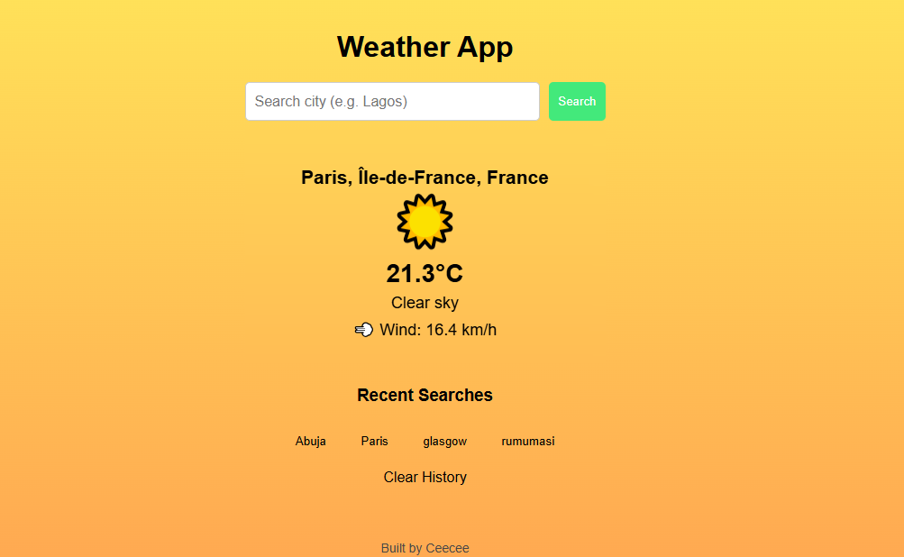

# CeeWeather ☁️

A responsive weather application that provides real-time weather data using the Open-Meteo API.

Users can search for cities, view current weather conditions, save recent searches and automatically reload their last searched city using localStorage.

---

## 🚀 Live Demo

[View Live Project]( https://ceecee-ferdy.github.io/ceeweather/)

---

## 📸 Preview

---

## ✨ Features

* Search weather by city name
* Real-time weather data using API
* Dynamic weather icons
* Dynamic background changes based on weather condition
* Save last searched city using localStorage
* Recent search history
* Clear search history
* Auto-load weather on page refresh
* Responsive design for mobile and desktop

---

## 🛠️ Built With

* HTML5
* CSS3
* JavaScript (ES6)
* Fetch API
* Async / Await
* LocalStorage
* Open-Meteo API

---

## 🧠 What I Learned

Through this project, I practiced:

* Working with APIs
* Using Fetch API with async/await
* Handling asynchronous JavaScript
* DOM manipulation
* Dynamic UI rendering
* Saving persistent data with localStorage
* Structuring JavaScript into reusable functions
* Building interactive frontend applications

---

## 🔮 Future Improvements

* 7-day weather forecast
* Better weather condition icons
* Search suggestions
* Temperature unit toggle (°C / °F)
* Geolocation weather detection

---

## 👩‍💻 Author

Built by Confidence — Frontend Developer

GitHub: https://github.com/ceecee-ferdy
